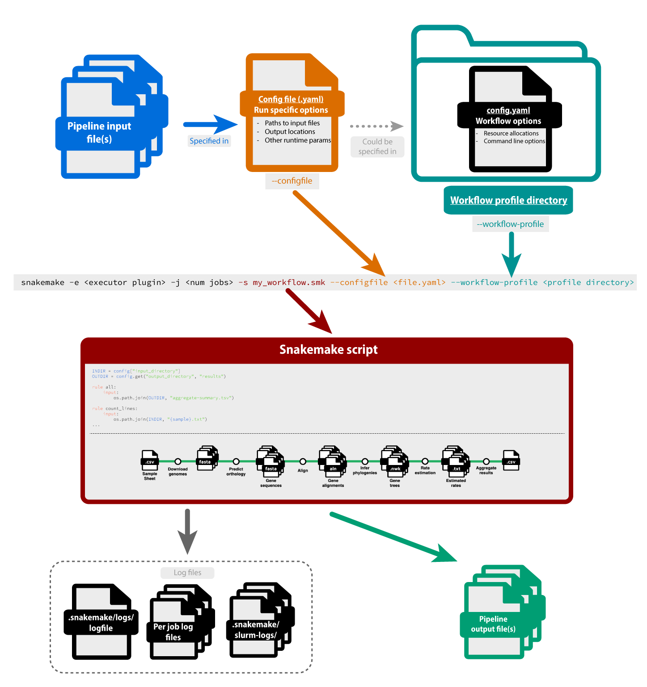

# Snakemake Workshop, part 1: Running Workflows

## Introduction

Welcome to today's workshop about the Snakemake workflow management software. This is day 1 of 2, where we'll be focusing on how to get pre-made workflows up and running. We'll touch on the basics of Snakemake's syntax and terminology, and learn how to debug some common problems. We'll also learn how to use Snakemake in conjunction with SLURM to really scale up your analyses.

If you haven't already, please follow the [Getting Started](../index.md) section to download the workshop materials and install Snakemake, as well as choose a text editor to work with on the cluster.

### Terminology

Before we get started teaching any workshop, I like to point out that, like any specific domain, the way we talk about programming is almost its own language. Words in this context may have different meaning than in other contexts. As programmers ourselves, we are so used to using words in the context of programming that we sometimes forget others aren't used to it.

This is all to say, if you hear us saying a word that you're familiar with but it's obvious that we're using it in a different way, or if you hear an unfamiliar term, please ask us to explain it. This knowledge gap is one of the most difficult parts about teaching a specific topic mostly because the teachers aren't usually aware of it.

We've put together a table of terms relating to Snakemake and workflows and their definitions in this context: [Workflow terminology](../../../resources/glossary/#workflow-management).

There are also other tables to browse on the glossary. Please let us know if there is anything you think we should add to this table.

## Workflows

What do we mean when we say **workflow**? Well, let's picture some typical steps for a phylogenomic analysis:

1. Download genomes of interest and their annotations
2. Extract annotated regions of each genome (*e.g.* longest transcript from of each gene) and predict orthology between transcripts of different species
3. Align orthologous sequences
4. Filter poorly aligned sequences
5. Create a phylogeny for each aligned gene
6. Assess rates of evolution across gene trees

Or:


This visualization of a workflow is called a **rule graph**. In this image, the sheafs of paper represent files (annotated with their file extensions) and the circles represent computational actions performed on those files (annotated with the description of that action). 

You can see that each of these steps requires input files, produces output files, and likely has an associated piece of software or a custom script written by the researcher. These steps and the tools associated with them are your analytical workflow - **the output of one step becomes the input of the next step**.

Importantly, each step needs to be done for each sample or gene or other discrete analysis element. For steps 1 and 2, you may have to run whatever tool you use for every sample in your data set, maybe dozens or even hundreds of times. For steps 3-7, you may have to run whatever tool you use for every gene in your analysis, possibly thousands of times.

Let's take a look at a single step, (3) align orthologous sequences. If we use a common program, such as [MAFFT :octicons-link-external-24:](https://en.wikipedia.org/wiki/MAFFT){ target="_blank" }, which aligns a single sequence at a time, what are our possible solutions to automate this for our potentially thousands of sequences?

### A bash script for every step

One of the most common ways to automate analyses prior to workflow languages was the use of custom shell scripts. A **shell** is the program behind the text interface on your terminal, with `bash` being one of the most common shells for Unix-like OSes. Shells themselves are like mini-programming languages, giving users the power to write code and commands to customize their environment. With that being said, one could write a **bash script** that loops over every unaligned sequence file in a directory, runs an alignment program on it, and saves the output:

```bash
#!/bin/bash

for locus in /path/to/loci/*.fasta
do
    locus_base=$(basename "$locus" .fasta)
    mafft "$locus" > /path/to/alignments/"$locus_base".fasta
done
```

??? example "Code breakdown"

    | Code                                                       | Description |
    | ---------------------------------------------------------- | ----------- |
    | `#!/bin/bash`                                              | The syntax of using `#!` at the beginning of a script is called a 'shebang'. When placed at the beginning of a script, the path following is the path to the program that should interpret the script (in this case, bash). |
    | `for locus in /path/to/loci/*.fasta`                       | This tells bash to loop over every file that has a `.fasta` file extension in the `/path/to/loci/ directory`. It assigns the current file name to the variable `locus`. |
    | `do`                                                       | Bash keyword for defining code blocks. |
    | `locus_base=$(basename "$locus" .fasta)`                   | This uses the basename command to store the filename as a string without the `.fasta` extension. |
    | `mafft "$locus" > /path/to/alignments/"$locus_base".fasta` | This runs mafft on the current locus file and stores the resulting alignment using the same filename in a different folder. |
    | `done`                                                     | Bash keyword for ending code blocks. |

One might (and should) save this set of commands as a script for reproducibility, possibly calling it something like `03_run_mafft.sh`. That way when you look back at your analysis, you'll be able to easily remember what commands you ran and be able to run them again if needed.

Of course, this is just one step in our workflow. We would likely need a script for each step: `01_download_samples.sh`, `02_extract_genes.sh`, ... and so on. Then we'd have to run them each individually and deal with individual errors, or perhaps write a meta-script that runs each of them sequentially as a sort of pseudo-workflow script.

There are two problems with this approach:

1. High maintenance
2. Difficult to parallelize

### Job arrays

**Job arrays** can help with the parallelization problem. A job array is a feature of most modern **job schedulers** that are installed on institutional clusters. A job scheduler is a a program that handles user requests for resources and allocates compute nodes based on resources available. On the Cannon cluster at Harvard, we use the [SLURM :octicons-link-external-24:](https://slurm.schedmd.com/overview.html){ target="_blank" } job scheduler.

In a typical SLURM job, you would write a SLURM script to submit a request to run some command on a compute node:

```bash
#!/bin/bash
#SBATCH --cpus-per-task=1
#SBATCH --mem=1G
#SBATCH --time=00:10:00

mafft locus1.fa > alignments/locus1.aln
```

??? example "Code breakdown"

    | Code                                      | Description |
    | ----------------------------------------- | ----------- |
    | `#!/bin/bash`                             | The syntax of using `#!` at the beginning of a script is called a 'shebang'. When placed at the beginning of a script, the path following is the path to the program that should interpret the script (in this case, bash). |
    | `#SBATCH --cpus-per-task=1`               | When a script is submitted as input to SLURM, lines that begin with `#SBATCH` are interpreted as SLURM options. This one specifies how many CPU are requested per task. |
    | `#SBATCH --mem=1G `                       | When a script is submitted as input to SLURM, lines that begin with `#SBATCH` are interpreted as SLURM options. This one specifies how much memory should be allotted for the job. |
    | `#SBATCH --time=00:10:00`                 | When a script is submitted as input to SLURM, lines that begin with `#SBATCH` are interpreted as SLURM options. This one specifies how much time is requested to run the job. |
    | `mafft locus1.fa > alignments/locus1.aln` | This runs mafft on a single file and saves the result to a file with redirection (`>`). |

Here, the `#SBATCH` comments give information to the SLURM scheduler. **Job arrays** allow us to scale this up, running multiple inputs on the same command, in parallel if resources are available.

For a job array, in the context of aligning sequences, you would first create a text file that just lists the paths to the input sequences. This is sometimes called a **manifest** file:

```
loci/locus1.fasta
loci/locus2.fasta
loci/locus3.fasta
...
loci/locus1453.fasta
```

In this example, let's call this file `loci.txt`. Then, in your SLURM script, you specify the number of jobs you'd like to submit and edit the script so it uses your the `SLURM_ARRAY_TASK_ID` to cycle through your files. 


```bash
#!/bin/bash
#SBATCH --cpus-per-task=1
#SBATCH --mem=1G
#SBATCH --time=00:10:00
#SBATCH --array=1-1453

# Get locus name for this array index as the line number in the file
locus=$(sed -n "${SLURM_ARRAY_TASK_ID}p" loci.txt)

locus_base=$(basename "$locus" .fasta)
mafft "$locus" > alignments/"$locus_base".aln
```

??? example "Code breakdown"

    | Code                                      | Description |
    | ----------------------------------------- | ----------- |
    | `#!/bin/bash`                             | The syntax of using `#!` at the beginning of a script is called a 'shebang'. When placed at the beginning of a script, the path following is the path to the program that should interpret the script (in this case, bash). |
    | `#SBATCH --cpus-per-task=1`               | When a script is submitted as input to SLURM, lines that begin with `#SBATCH` are interpreted as SLURM options. This one specifies how many CPU are requested per task. |
    | `#SBATCH --mem=1G `                       | When a script is submitted as input to SLURM, lines that begin with `#SBATCH` are interpreted as SLURM options. This one specifies how much memory should be allotted for the job. |
    | `#SBATCH --time=00:10:00`                 | When a script is submitted as input to SLURM, lines that begin with `#SBATCH` are interpreted as SLURM options. This one specifies how much time is requested to run the job. |
    | `#SBATCH --array=1-1453`                  | When a script is submitted as input to SLURM, lines that begin with `#SBATCH` are interpreted as SLURM options. This one specifies that 1453 tasks will be run in a job array. |
    | `locus=$(sed -n "${SLURM_ARRAY_TASK_ID}p" loci.txt)` | This reads the manifest file with a tool called `sed` and gets the file name based on the line number in the file and the SLURM task id.
    | `locus_base=$(basename "$locus" .fasta)` |  This uses the basename command to store the filename as a string without the `.fasta` extension. |
    | `mafft "$locus" > alignments/"$locus_base".aln` | This runs mafft on the current locus file and stores the resulting alignment using the same filename in a different folder. |

In this case, we must know ahead of time how many times we want to run this step, *i.e.* how many genes we want to align. In this made up example, let's say we have 1453 genes, so we specify that this job array will create 1453 tasks by using `#SBATCH --array=1-1453`. Then, in our script, we use a command called `sed` to pull the locus ID as the line number in the manifest file and use that ID as the basis for input and ouput from our alignment program. Then in the alignment program itself, instead of specifying an exact file name, we use the file name constructed from the locus ID. This will be constructed and submitted as a separate task for all 1453 loci.

Job arrays effectively solve the parallelization problem: as many of the tasks that there are resources available for will be submitted at once. However, you would still need to maintain a separate job array script for each step of the workflow.

### Workflow languages

Workflow languages try to lower the development and maintenance costs of compiling steps into a workflow while easily paralellizing tasks and even integrating with job schedulers. They also add infrastracture that allows one to start and stop the workflow, resume workflows if stopped or an error is encountered, and add samples to the workflow potentially without having to re-run all steps for all samples.

Today, of course, we'll be talking about [**Snakemake** :octicons-link-external-24:](https://snakemake.readthedocs.io/en/stable/){ target="_blank" }, but there are other workflow languages out there, including [Nextflow :octicons-link-external-24:](https://www.nextflow.io/docs/latest/index.html){ target="_blank" } and [Common Workflow Language :octicons-link-external-24:](https://www.commonwl.org/){ target="_blank" }.

## Snakemake

Snakemake is a scripting language built from Python (with a bit of YAML formatting mixed in). Its design philosophy is based on the standard `make` tool used commonly when building software: there should be an end result of the script which should be a file or files. These are the **targets**, and the workflow builds from the target backwards. It is essentially asking itself, "What do I need to do to produce these target files?"

In our example of a phylogenomic analysis, the target would be the final `.csv` file with the results of the rate analysis. Snakemake would see that as the target and look backwards: Are all the gene trees that it was expecting to be there actually there? If not, then it will look backwards: Are all the alignments that it was expecting to be there actually there? And so on until it encounters a step where all the outputs exist, from which it would start moving forward through the pipeline.


### Rules

Snakemake and other workflow languages are made up of **rules**. A rule encompasses one step of your workflow. For example, a rule for our alignment step may look something like this:

```yaml
rule mafft_align:
    input:
        "loci/locus{locus_id}.fasta"
    output:
        "alignments/locus{locus_id}.aln"
    shell:
        "mafft {input} > {output}"
```

At the bare minimum, rules require both **input** and **output** along with the command to run. Here this comes in the form of a **shell directive** , which means snakemake will take whatever is typed in there and plug directly into the shell, substituting the appropriate parameters for each task. Other ways to run commands are with **run** and **script** directives, which we'll learn more about in the Develop part of the workshop. The ability to run different types of commands with access to the variables defined in the workflow script is one of Snakemake's big advantages over bash scripts or job arrays.

There are also other **directives** that can be added to a rule, such as `params:`, `log:`, `resources:`, and so on. Again, we will cover these more during the Develop portion of the workshop.

You'll notice that the use of curly brackets `{}` is prevalent in Snakemake. In the `shell:` directive, `{input}` and `{output}` mean that Snakemake will directly plug in whatever is defined in the `input:` and `output:` directives into the shell command.

However, you'll also notice the word `{locus_id}` in curly brackets in both the `input:` and `output:` directives. This is called a **wildcard** and is one of the most important concepts in understanding how Snakemake workflows are run.

### Wildcards

Snakemake works backwards from a target rule, usually called `rule all:` and tries to complete the `output:` directives for each rule. Importantly, `output:` directives are interpreted as a **list of files**. The problem is that we can't always type out the entire list of files output for each rule, or in some cases we may not even know the names of the output files.

Enter wildcards. Wildcards are essential to know about when running a workflow so you know how to setup your input files. Wildcards are patterns that Snakemake uses to find and define file names. Recall in our job array where we used a **manifest** file and then parsed out a locus ID from that list of files. This locus ID is a wildcard.

```
loci/locus1.fasta
loci/locus2.fasta
loci/locus3.fasta
...
loci/locus1453.fasta
```

The wildcards will be determined by the pipeline inputs, but are parsed by the workflow itself. **This means its crucial to follow the file naming conventions specifed in the documentation of the workflow.**

You may already have run into naming conventions in your own scripts which help you understand where a file came from, what sample number it is, and what steps in the analysis it has been through. For example, in the demo rule graph, we start with fasta files, so files may be named `locus1.fasta`, `locus2.fasta`, etc. Subsequent steps might have the output files be named `locus1_aligned.fasta`, `locus2_aligned.fasta`, etc. Wildcards take the part of the file name that is variable and substitutes it in the rule. In the `mafft_align` rule above, the `{locus_id}` will be replaced with the actual locus ID, such as `locus1`, `locus2`, etc. Under the hood, Snakemake will create a list of all potential inputs and outputs for each rule using these wildcards so it knows exactly what files to look for and what files it needs to generate. 

## Preparing the config file

Every Snakemake workflow you run will have different inputs and parameters required to run it. Hopefully these are very well documented in the workflow's documentation.

All of the inputs and parameters should be specified with a **config file**. This is a [YAML formatted :octicons-link-external-24:](https://en.wikipedia.org/wiki/YAML){ target="_blank" } text file, which means options are usually specfied as `<option_name>: <value>`. For instance, for the very basic `mafft_align` rule above, the config file would need to specify the path to the manifest file, listing all the input fasta files:

```yaml
manifest_file: path/to/manifest.txt
```

This manifest file would be parsed elsewhere in the workflow and the list of files used directly or the wildcards extracted from their filenames.

### Demo workflow

Let's run a demo workflow. Using the terminal, navigate to the `run/` directory of the workshop materials. When you `ls` in this directory, you should see a file called `demo.smk`. This is a Snakemake workflow script. We've prepared a very simple workflow that counts the words and lines in any number of files specified. What happens if we try to run this workflow?

> **Exercise:** Try running the workflow. For Snakemake workflows, at minimum you need to specify the path to the workflow file and the number of cores (or jobs) the workflow should use (or spawn).

```bash
snakemake -j 1 -s demo.smk
```

??? example "Command breakdown"

    | Command line option | Description |
    | ------------------- | ----------- |
    | `snakemake`         | The call to the Snakemake program |
    | `-j 1`              | This tells the workflow to use 1 processing core |
    | `-s demo.smk`       | The path to the workflow script file |

What happened? We got an error referring to something about a `sample_sheet`. This is because we haven't done anything to prepare our particular input files for this workflow. Snakemake scripts should be generalizeable to any set of similar inputs, so we need to know how to prepare our own inputs to run through the file. The workflow documentation is crucial for this.

Let's say we found the following documentation for this workflow:

!!! abstract "Documentation for demo.smk"

    **Workflow summary**

    This workflow takes any number of input files and counts the number of words and lines in those files. It then summarizes the counts in a single file called `results/aggregate-summary.tsv`.

    **Workflow inputs**

    This workflow requires a sample sheet that lists one sample per line. Samples must be the basenames of the input files (*e.g.* for file `sample12.txt` the corresponding line in the sample sheet should read `sample12`). You can name this sample sheet file anything you want.

    **Workflow config file**
    
    The sample sheet is specified in the config file with an entry called `samples:` with the value of that entry being the path to your sample sheet file, *e.g.* `sample_sheet: samples.txt` if your sample sheet file is named `samples.txt`.

    Also specified in the config file is the input directory with `input_directory:`. This directory should contain all the files that correspond to samples (*e.g.* `sample12.txt`). An output directory can also be specified with `output_directory:`, but this is optional. The default output directory is `results/`.

> **Exercise:** Based on the workflow documentation, create a *sample sheet* and a *config file* for this workflow. Place the files in the same directory as the `demo.smk` file. In our analysis, we have two sample files to run, `sample1.txt` and `sample2.txt` located in the directory `demo-data/`.

??? success "Solution"

    You can find the solution config file and samplesheet in the `run/complete/` directory.

!!! note "Config templates"

    One of the most useful pieces of documentation that can come with a workflow is a config template. This template would have all the parameters listed with comments (denoted by lines starting with `#`) that document what each parameter is and what is supposed to be input. For the purposes of the above exercise, though, we'll be building the simple config from scratch!

### The dryrun

Now that we've followed the documentation about how to setup the inputs for the workflow, we need to see if we've set everything up correctly. To do this, we want to perform a **dryrun**. The dryrun means Snakemake will parse the workflow inputs and run through the rules of the workflow to see what needs to be done to produce the target output, but importantly it *won't actually run the rules.* Instead, it will just print a long summary of what needs to be done.

> **Exercise:** Use your config file to run do a dryrun of the workflow:

```bash
snakemake -j 1 -s demo.smk --configfile <config file name> --dryrun
```

??? example "Command breakdown"

    | Command line option | Description |
    | ------------------- | ----------- |
    | `snakemake`         | The call to the Snakemake program |
    | `-j 1`              | This tells the workflow to use 1 processing core |
    | `-s demo.smk`       | The path to the workflow script file |
    | `--configfile <config file name>` | The option to specify the path to your config file |
    | `--dryrun` | Tell Snakemake to perform a dryrun rather than execute the workflow |

After running through every single task it will set out to do when asked to, Snakemake will print out a nice summary table that should look something like this:

```
Job stats:
job               count
--------------  -------
aggregate             1
all                   1
combine_counts        2
count_lines           2
count_words           2
total                 8
```

This tells us every rule Snakemake will run and the number of times it will be run, in this case based on the number of samples in our sample sheet.

!!! tip "dryruns are super important!"

    The `--dryrun` should always be the first thing you do whenever you run a new workflow, or even an old workflow with new data! This will help you understand what the workflow is doing and catch errors in your setup before any part of the workflow executes.

That table is pretty nice, but for complex workflows it would be nice to visualize this in some way.

## Rulegraphs and DAGs

Snakemake can also display the outline of a workflow in visual format by printing out the **rulegraph**, which displays how the rules are connected to each other. It can also create a **DAG**, which stands for **directed acyclic graph** and shows how each individual task is connected. In the context of our demo, the rulegraph displays the rules while the DAG displays the rules *per sample*.

Let's generate both to see the difference.

> **Exercise:** Generate the rulegraph for the demo workflow:

```bash
snakemake -j 1 -s demo.smk --configfile <config file name> --rulegraph
```

??? example "Command breakdown"

    | Command line option | Description |
    | ------------------- | ----------- |
    | `snakemake`         | The call to the Snakemake program |
    | `-j 1`              | This tells the workflow to use 1 processing core |
    | `-s demo.smk`       | The path to the workflow script file |
    | `--configfile <config file name>` | The option to specify the path to your config file |
    | `--rulegraph` | This tells Snakemake to print out the rulegraph in text |

This essentially does a dryrun, but emits output in a different format. You should see something like this:

```
Building DAG of jobs...
digraph snakemake_dag {
    graph[bgcolor=white, margin=0];
    node[shape=box, style=rounded, fontname=sans,                 fontsize=10, penwidth=2];
    edge[penwidth=2, color=grey];
        0[label = "all", color = "0.13 0.6 0.85", style="rounded"];
        1[label = "aggregate", color = "0.00 0.6 0.85", style="rounded"];
        2[label = "combine_counts", color = "0.27 0.6 0.85", style="rounded"];
        3[label = "count_lines", color = "0.40 0.6 0.85", style="rounded"];
        4[label = "count_words", color = "0.53 0.6 0.85", style="rounded"];
        1 -> 0
        2 -> 1
        4 -> 2
        3 -> 2
}
```

Well... that's actually less useful than the table from the dryrun. Fortunately, it is a format that is understood by another tool, `dot`. `dot` will take this as input and produce a graph image.

??? question "dot: command not found"

    `dot` should be installed on the Cannon cluster. You can always check by typing `dot -h`. If a help menu comes up, `dot` is installed. If any type of `dot: command not found` message appears, your system does not have `dot` installed. In that case, `dot` is part of the [Graphviz :octicons-link-external-24:](https://graphviz.org/){ target="_blank" } package and can be [installed with conda/mamba :octicons-link-external-24:](https://anaconda.org/conda-forge/graphviz){ target="_blank" }.

> **Exercise:** Generate an image of the rulegraph with `dot`:

```bash
snakemake -j 1 -s demo.smk --configfile <config file name> --rulegraph | dot -Tpng > demo-rulegraph.png
```

??? example "Command breakdown"

    | Command line option  | Description |
    | -------------------  | ----------- |
    | `snakemake`          | The call to the Snakemake program |
    | `-j 1`               | This tells the workflow to use 1 processing core |
    | `-s demo.smk`        | The path to the workflow script file |
    | `--configfile <config file name>` | The option to specify the path to your config file |
    | `--rulegraph`        | This tells Snakemake to print out the rulegraph in text |
    | `|`                  | The shell's piping operator, which tells the shell to use the output of one command (`snakemake` here) as the input of another command (`dot` here) |
    | `dot`                | The call to the `dot` program |
    | `-Tpng`              | This option tells `dot` to format its output as a png image |
    | `>`                  | The shell's redirect operator, which tells the shell to save the output of the command on the left (`dot`) as the file named on the right |
    | `demo-rulegraph.png` | The name of the file to save `dot`'s output |


If there are no errors, there should now be a file called `demo-rulegraph.png` in your working directory. If you are able to view it somehow (either remotely or by transferring locally), it would look something like this:

<!--

-->

<center></center>

Now this clearly shows what this workflow is doing, including the names of the rules that are run and the order in which they will be run. We see there is a branching structure to the workflow: since the rules `count_lines` and `count_words` both depend on the same input files but don't depend on each other they can be run simultaneously. The `combine_counts` rule, however, depends on output from both of those rules, so it must wait for them to complete. This leads into the `aggregate` rule and finally the target rule `all`, which is standard in most Snakemake workflows as the final rule -- it takes input but creates no output.

> **Exercise:** Let's also create a DAG for this workflow given our inputs:

```bash
snakemake -j 1 -s demo.smk --configfile <config file name> --dag | dot -Tpng > demo-dag.png
```

??? example "Command breakdown"

    | Command line option  | Description |
    | -------------------  | ----------- |
    | `snakemake`          | The call to the Snakemake program |
    | `-j 1`               | This tells the workflow to use 1 processing core |
    | `-s demo.smk`        | The path to the workflow script file |
    | `--configfile <config file name>` | The option to specify the path to your config file |
    | `--dag`              | This tells Snakemake to print out the DAG in text |
    | `|`                  | The shell's piping operator, which tells the shell to use the output of one command (`snakemake` here) as the input of another command (`dot` here) |
    | `dot`                | The call to the `dot` program |
    | `-Tpng`              | This option tells `dot` to format its output as a png image |
    | `>`                  | The shell's redirect operator, which tells the shell to save the output of the command on the left (`dot`) as the file named on the right |
    | `demo-dag.png` | The name of the file to save `dot`'s output |

Here is what the DAG looks like:

<!--

-->

<center></center>

Here, we see parts of the rulegraph duplicated. Specifically, the rules `count_lines` and `count_words` are run twice, once for each sample. `combine_counts` is also run twice on the output of the `count_lines` and `count_words` rules. The `aggregate` rule is run once, combining all counts from all samples, and the target rule `all` is present as the endpoint for the workflow.

The DAG also clearly labels the **wildcards**. Within our script, there is a wildcard called `sample` and recall we specified each sample in our sample sheet. This shows how those are associated with the `sample` wildcard in the DAG.

Viewing that rulegraph and DAG of your workflow can be extremely helpful in understanding what tasks the workflow is accomplishing. The DAG will update accordingly for each different input to the workflow, changing the wildcards or file names associated with each task. However, the DAG can get huge and unreadable for large workflows. The rulegraph on the other hand is static. Since it only shows the ordering of the rules, the inputs don't change it. 

!!! tip "dryruns and rulegraphs"

    Always run a dryrun and use a rulegraph before executing your workflow. This will help you know what to expect when you actually do execute the workflow

### Example workflows and their rulegraphs

Documented workflows for common tasks may exist, and those that are well supported and maintained should always display their rulegraphs in their documentation or publications. Let's go through some examples and discuss what we think these workflows do:

#### grenepipe

[Pipeline :octicons-link-external-24:](https://github.com/moiexpositoalonsolab/grenepipe){ target="_blank" } | [Rulegraph :octicons-link-external-24:](https://github.com/moiexpositoalonsolab/grenepipe/wiki/Rule-Call-Graph){ target="_blank" }

??? tip "Show rulegraph"

    <center></center>

#### Cactus related pipeline #1

[Pipeline :octicons-link-external-24:](https://github.com/harvardinformatics/cactus-snakemake/){ target="_blank" } | [Rulegraph :material-arrow-top-right:](https://informatics.fas.harvard.edu/resources/tutorials/replace-genome-whole-genome-alignment-cactus/){ target="_blank" }

??? tip "Show rulegraph"

    <center></center>

#### snpArcher

[Pipeline :octicons-link-external-24:](https://snparcher.readthedocs.io/en/latest/){ target="_blank" } | [Rulegraph :octicons-link-external-24:](https://doi.org/10.1093/molbev/msad270){ target="_blank" }

??? tip "Show rulegraph"

    <center></center>

#### Cactus related pipeline #2

[Pipeline :octicons-link-external-24:](https://github.com/harvardinformatics/cactus-snakemake/){ target="_blank" } | [Rulegraph :material-arrow-top-right:](https://informatics.fas.harvard.edu/resources/tutorials/whole-genome-alignment-cactus/){ target="_blank" }

??? tip "Show rulegraph"

    <center></center>

<!-- good time for the 10/15 minute break -->

## Debugging workflows

While Snakemake workflows should be relatively low maintenance, there are always problems that can arise. Commonly, poor documentation or complex workflows combined with Snakemake's somewhat cryptic error messages can lead to confusion for the user. Here we'll try to introduce you to some common issues you might run into while running a workflow.

### Debugging a dryrun

Many issues can be caught during a dryrun. Fortunately, dryruns are quick, making them easy to debug in the sense that you can re-run them over and over again.

#### `KeyError`

<!-- demo files 01 -->

You'll usually see a `KeyError` if something is wrong in your config. Either a missing parameter or a typo.

Run the following command to see an example of a `KeyError` using our demo workflow:

```bash
snakemake -j 1 -s demo.smk --configfile debugging-demos/01-config.yml --dryrun
```

??? example "Command breakdown"

    | Command line option                          | Description |
    | -------------------------------------------  | ----------- |
    | `snakemake`                                  | The call to the Snakemake program |
    | `-j 1`                                       | This tells the workflow to use 1 processing core |
    | `-s demo.smk`                                | The path to the workflow script file |
    | `--configfile debugging-demos/01-config.yml` | The option to specify the path to your config file |
    | `--dryrun`                                   | Tell Snakemake to perform a dryrun rather than execute the workflow |

You should something like:

```
KeyError in file "/n/holylfs05/LABS/informatics/Lab/training/snakemake-workshop/run/demo.smk", line 1:
'sample_sheet'
  File "/n/holylfs05/LABS/informatics/Lab/training/snakemake-workshop/run/demo.smk", line 1, in <module>
```

> **Exercise:** Open the `debugging-demos/01-config.yml` config file in your favorite text editor* and debug the problem. Then re-run the dryrun.
>
> \* If you don't have a favorite text editor, just use `nano`. Type `nano debugging-demos/01-config.yml` to open the file for editing. Type freely with the keyboard. There is no mouse functionality so use the arrow keys to navigate. Use `ctrl-o` followed by `<enter>` to save the file. Use `ctrl-x` to exit. If you make changes and use `ctrl-x` to exit without saving, you will be prompted to save the file.

??? success "Solution"

    The problem is that the config file spelled "sample_sheet" wrong. It's spelling "sample_hseet". Fixing that typo should allow the dryrun to complete successfully.

#### `FileNotFoundError`

This is a pretty generic error that could happen for a lot of reasons. Fortunately, there is usually more context involved in that it will usually list the file that it can't find.

> **Exercise:** Run the following command to see a `FileNotFoundError`. Fix the problem and re-run so the dryrun completes successfully:

```bash
snakemake -j 1 -s demo.smk --configfile complete/demo-config1.yml --dryrun
```

??? example "Command breakdown"

    | Command line option                      | Description |
    | ---------------------------------------  | ----------- |
    | `snakemake`                              | The call to the Snakemake program |
    | `-j 1`                                   | This tells the workflow to use 1 processing core |
    | `-s demo.smk`                            | The path to the workflow script file |
    | `--configfile complete/demo-config1.yml` | The option to specify the path to your config file |
    | `--dryrun`                               | Tell Snakemake to perform a dryrun rather than execute the workflow |

??? success "Solution"

    The problem here is that the config file is not named correctly on the command line. It should be `01-config.yml`. 

#### `MissingInputException`

<!-- demo files 02 -->

These can be a bit trickier. Since these errors only happen during Snakemake's assessment of the DAG, the error messages can be more confusing since they may refer to files that haven't yet been created. These errors typically mean that one of the expected inputs to a rule can't be created by the DAG given the overall workflow inputs. One cause may be a mismatch between an input file in a sample sheet and what files actually exist:

```bash
snakemake -j 1 -s demo.smk --configfile debugging-demos/02-config.yml --dryrun
```

??? example "Command breakdown"

    | Command line option                          | Description |
    | -------------------------------------------  | ----------- |
    | `snakemake`                                  | The call to the Snakemake program |
    | `-j 1`                                       | This tells the workflow to use 1 processing core |
    | `-s demo.smk`                                | The path to the workflow script file |
    | `--configfile debugging-demos/02-config.yml` | The option to specify the path to your config file |
    | `--dryrun`                                   | Tell Snakemake to perform a dryrun rather than execute the workflow |

> **Exercise:** Track down the problem with the above command and fix it so the dry run completes successfully.

??? success "Solution"

    The problem here is that the sample sheet lists a sample called `sample3`, but there is no corresponding file in the input directory `demo-data`. Additionally, `sample1.txt` is not how you are supposed to list samples in the sample sheet. You should just list `sample1` and `sample2` on separate lines.

### Debugging during execution

While debugging problems during a dryrun is at least somewhat straightforward, debugging problems that occur while actually executing the pipeline can be more difficult. This is because dryrun errors typically only involve the things that Snakemake checks when building the DAG, which, for a well designed workflow, are usually setup errors with the config file.

Problems during execution, however, can involve errors in (1) the Snakemake workflow itself, (2) the tools that the rules call, or (3) as we'll see later on, errors with the cluster on which the workflow is run. Each of these may or may not produce their own log file, to which information about the error might be written.

#### The Snakemake log

Every Snakemake execution run generates a `.snakemake/` directory within the directory from which it was run. Most of this is internal Snakemake stuff that it uses to keep track of job progress and software environments. However, there are exceptions.

Each Snakemake execution run also generates a log file. These are stored in `.snakemake/log/` and are named with the timestamp at which they were run. Because they're all saved, it can be difficult to remember which log goes with any particular time you tried to run the workflow, so it is a good idea to save any log file name you might need in the future. The name of the Snakemake log file will be displayed on the screen at the end of each run. Type `ls .snakemake/log/` to see all the log files you've generated so far in this workshop.

The Snakemake log files contain a lot of information, including summaries of every rule executed for every wildcard. This is nice, but can also make the log file difficult to read.

#### Command log files

In a Snakemake workflow, if a rule uses a `shell:` directive to run a command, that command may also leave its own log file. In fact, well designed workflows should have log files for every task! These log files are often where the informative error message lies.

> **Exercise:** Run the following to produce an error. Check the Snakemake log to try and figure out what went wrong.

```bash
# First a dryrun, which should complete successfully:
snakemake -j 1 -s debugging-demos/03-demo.smk --configfile debugging-demos/03-demo-config.yml --dryrun

# Then run the workflow, which should produce an error:
snakemake -j 1 -s debugging-demos/03-demo.smk --configfile debugging-demos/03-demo-config.yml
```

??? example "Command breakdown"

    | Command line option                               | Description |
    | ------------------------------------------------  | ----------- |
    | `snakemake`                                       | The call to the Snakemake program |
    | `-j 1`                                            | This tells the workflow to use 1 processing core |
    | `-s debugging-demos/03-demo.smk`                  | The path to the workflow script file |
    | `--configfile debugging-demos/03-demo-config.yml` | The option to specify the path to your config file |
    | `--dryrun`                                        | Tell Snakemake to perform a dryrun rather than execute the workflow |

??? success "Solution"

    The dry run completed successfully, which means the logic of the workflow is sound. However, when we actually run the workflow, we get an error. The log will show that the error occurred while running the `count_words` rule and that the reason it failed was that it did not produce the expected output file `reason: Missing output files:`. You can check that the wildcard is correct (`wildcards: sample=sample2`). There should then be a printout of the exact command that was run under "Command:". Look inside and you will see that the command has a typo: instead of `wc -w` it says `wc-demo-error`. Fixing that typo in the `03-demo.smk` file should allow the workflow to complete successfully.

There are lot's of things that could go wrong during the execution of a workflow, so we're not going to go through other examples. But hopefully now you at least know how to get started in tracking down any problems you encounter.

## Running on a Cluster

Snakemake inherently solves some of the problems of complex data analysis workflows that we mentioned at the beginning of the workshop. Specifically, they make analyses reproducible and are relatively low maintenance once they are written. However, we haven't yet tackled the parallelization problem

Well, it turns out Snakemake inherently deals with this as well, because it is able to run jobs in the rulegraph that don't depend on each other simultaneously. This can easily be controlled with the `-j` argument, which we've only supplied with the value `1` until now. If this is increased to, say, `4`, then the workflow will, whenever possible, run up two 4 jobs simultaneously.

This alone, however, isn't that helpful for large workflows since it is limited by the resources on the computer where Snakemake is run. Where Snakemake and other workflow managers really take off is when they are integrated with a job scheduling system (like SLURM) on a high-performance computing (HPC) cluster.

### Executor plugins

Snakemake integrates with job schedulers by using a set of **plugins**. These plugins are just additional software packages. See the list of plugins in the [Snakemake plugin catalogue :octicons-link-external-24:](https://snakemake.github.io/snakemake-plugin-catalog/index.html){:target="_blank"}. Here, you'll notice a series of **executor** plugins, which are used specifically to run jobs on specific job schedulers.

> **Exercise:** Find the **slurm executor** plugin on the plugin catalogue page and read the documentation to find out how to install it, then install it in your environment. Run the following to make sure it is installed:

```bash
snakemake -e slurm -j 1 -s demo.smk --configfile complete/demo-config.yml --dryrun
```

??? example "Command breakdown"

    | Command line option                     | Description |
    | --------------------------------------  | ----------- |
    | `snakemake`                             | The call to the Snakemake program |
    | `-e slurm`                              | The snakemake executor plugin option to submit jobs to a corresponding job schedule, in this case slurm |
    | `-j 1`                                  | This tells the workflow to submit 1 job to the executor at a time |
    | `-s demo.smk`                           | The path to the workflow script file |
    | `--configfile complete/demo-config.yml` | The option to specify the path to your config file |
    | `--dryrun`                              | Tell Snakemake to perform a dryrun rather than execute the workflow |

If you get an error, then there was likely a problem with the plugin installation and you should ask us about it. Otherwise, the dryrun should complete normally.

Note the  `-e slurm` option. This tells Snakemake we'd like to use the SLURM executor plugin for submitting jobs to a SLURM cluster. Now, instead of running tasks locally (or on the login node to which you are connected), each task will be submitted as a SLURM job!

### Resources

While submitting the above command for execution may work, we're still lacking a key aspect of submitting jobs to a cluster: resource allocation requests.

In order for Snakemake and SLURM to know how to submit these jobs, we have to give them information about how many resources they will need. In particular, we need to specify:

- Memory
- CPUs
- Partition/queue
- Runtime

Depending on what cluster you are using, you may also need to specify other resources, such as `account`. 

While **partition** and **CPUs** are somewhat deterministic, **memory** and **runtime** usually require us to give best estimates. This can be a tricky task, and there aren't hard and fast rules for determining this even outside the context of Snakemake.

In the context of Snakemake, resources need to be specified keeping in mind that each rule may run multiple jobs on different inputs, so you'll have to request what you think is the most memory and runtime a given rule would need for the highest resource demanding input.

Resources can be set for all rules using default values, or set on a per-rule basis.

### Profiles

Resources in a Snakemake workflow are most easily managed by the use of **workflow profiles**. This is a **directory** that contains another **YAML** formatted file (or sometimes a set of files) that contain information related to how you want the workflow to be run. It is required that the YAML file be named **config.yaml** within the profile folder.

We have provided a workflow profile for the demo workflow at `demo-profile/`. The contents of the `config.yaml` file in that folder are:

```yaml
default-resources:
  slurm_partition: test
  mem_mb: 2048
  runtime: 00:05:00
  cpus_per_task: 1

set-resources:
  count_lines:
    slurm_partition: test
    mem_mb: 1024
    runtime: 00:01:00
    cpus_per_task: 1
```

Here, we have specified default resources to submit for all jobs. But for jobs submitted from the `count_lines` rule we've provided a different set of resources. If you'd like to see this in action, use the following command:

```bash
snakemake -e slurm -j 5 -s demo.smk --configfile complete/demo-config.yml --workflow-profile demo-profile/
```

??? example "Command breakdown"

    | Command line option                     | Description |
    | --------------------------------------  | ----------- |
    | `snakemake`                             | The call to the Snakemake program |
    | `-e slurm`                              | The snakemake executor plugin option to submit jobs to a corresponding job schedule, in this case slurm |
    | `-j 5`                                  | This tells the workflow to submit 5 jobs to the executor at once |
    | `-s demo.smk`                           | The path to the workflow script file |
    | `--configfile complete/demo-config.yml` | The option to specify the path to your config file |
    | `--workflow-profile demo-profile/`      | The option to specify the path to the workflow profile directory containing a `config.yaml` file with resources allocations and command line options  |

Note here the `--workflow-profile` option gives the **path to the directory containing the config.yaml file** where your resources are specified. We've also included `-e slurm` and increased `-j` to `5`, meaning that at most 5 jobs will be submitted to the cluster simultaneously.

> **Exercise:** Edit the workflow profile config file in `complete/demo-profile/config.yaml` to specify the following resources for the rule `count_words:`: 512MB of memory, 7 minute run time, 1 CPU, and the "shared" partition. Re-run the workflow if desired.

??? success "Solution"

    The `count_words` rule can be specified in the `set-resources:` section of the `config.yaml` file like so:

    ```yaml
    set-resources:
      count_lines:
        slurm_partition: test
        mem_mb: 1024
        runtime: 00:01:00
        cpus_per_task: 1
      count_words:
        slurm_partition: shared
        mem_mb: 512
        runtime: 00:07:00
        cpus_per_task: 1
    ```

Profiles can actually be used to specify any of the command line arguments for Snakemake, including the `--configfile` and the workflow script (`-s`).

> **Exercise**: Edit the workflow profile such that the following dry run completes successfully:

```bash
snakemake --workflow-profile demo-profile/ -s demo.smk --dryrun
```

??? example "Command breakdown"

    | Command line option                     | Description |
    | --------------------------------------  | ----------- |
    | `snakemake`                             | The call to the Snakemake program |
    | `--workflow-profile demo-profile/`      | The option to specify the path to the workflow profile directory containing a `config.yaml` file with resources allocations and command line options  |
    | `--dryrun`                              | Tell Snakemake to perform a dryrun rather than execute the workflow |   

??? success "Solution"

    The `configfile` needs to be added to this profile. See the solution in `run/complete/demo-profile/config.yaml`.

!!! tip "Snakefiles named 'snakefile'"

    If you name your snakemake script (typically called a **snakefile**) `snakefile` and you run snakemake from within the directory where it is saved, then you don't have to specify it at all! Snakemake by default will look for a file called `snakefile` to run.

Think of the workflow profile as the config for Snakemake itself, specifying program arguments and resources, while the workflow config file is the config file for a particular set of inputs to run through the profile.

## Snakemake outline

<div>
    <input type="checkbox" id="popup" style="display:none;">
    <div class="backdrop" onclick="popup.checked=false;">
      <label for="popup">
        
      </label>
    </div>
    <div class="caption">Click to view</div>
    <label for="popup">
      <center></center>
    </label>
</div>

## End Part 1

Let us know if you have any questions and be sure to attend part 2, Develop, where we'll learn how to actually write a Snakemake pipeline!

<!-- --------------------------------- -->
<!-- Page specfic CSS -->

<style>
    /* ----- */
    /* Pop-up image viewer */    
    .backdrop {
        display: none;
        position: fixed; top:0; left:0; width:100vw; height:100vh;
        background: rgba(0,0,0,0.5);
        z-index: 10;
        text-align: center;
        justify-content: center;
        align-items: center;
        display: flex;
    }
    #popup:not(:checked) ~ .backdrop {
        display: none;
    }
    #popup:checked ~ .backdrop {
        display: flex;
    }
    .fullimg {
        max-width: 100vw;
        max-height: 100vh;
        margin: 0;
        display: block;
        background-color: #fff;
    }
    .caption {
        color: #aaa;
        font-style: italic;
        font-size: 1.1em;
        margin-bottom: 8px;
        text-align: center;
        letter-spacing: 0.02em;
    }    

    /* ----- */
    /* Hide all 2nd-level navs */
    .md-nav--secondary .md-nav__item .md-nav {
        display: none !important;
    }

    /* Show when parent has .expanded class, which is added by js/collapse_toc.js */
    .md-nav--secondary .md-nav__item.expanded > .md-nav {
        display: block !important;
    }    
</style>
